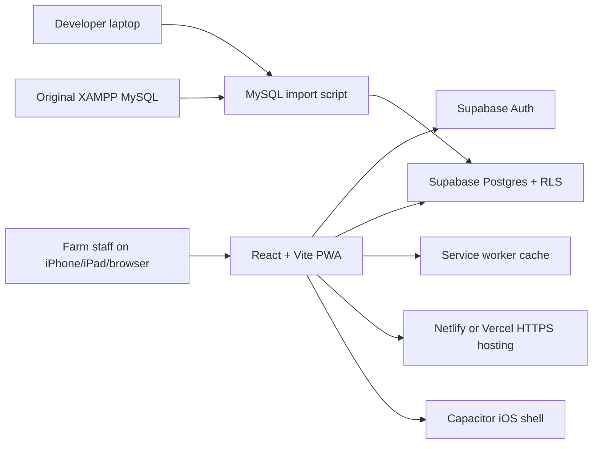

# PigTrack Pro System Design

## Goal

PigTrack Pro recreates the original XAMPP/PHP piggery management system as a mobile-first React app. The same codebase can be deployed as a secure HTTPS PWA and wrapped later as an iOS application with Capacitor.

## Architecture



## Main Modules

- Dashboard: active pigs, average weight, revenue, feed alerts, and pending tasks.
- Pig management: pigs, breeds, pens, weights, breeding records, and mortality-compatible data model.
- Health and feeding: health records, feed inventory, feeding logs, and low stock visibility.
- Finance: sales, expenses, and reporting.
- Admin: staff profiles and role based access.

## Data Layer

Supabase Postgres replaces the local MySQL database for hosted use. The schema in `supabase/schema.sql` mirrors the original tables and adds:

- `profiles` for app users mapped to Supabase Auth users.
- Row level security policies.
- Permission helper functions.
- Triggers for `updated_at` and pen counts.

The app can also run in demo mode when Supabase environment variables are not set.

## Security Model

- Authentication is handled by Supabase Auth.
- Authorization is enforced in the UI and should also be enforced by Supabase RLS policies.
- Public client builds only use the Supabase anon key.
- The Supabase service role key is used only for local migration and must never be deployed.
- Deployment should use HTTPS through Netlify, Vercel, or Supabase-hosted endpoints.

## Mobile Strategy

The recommended first deployment is a PWA because it is free, HTTPS-secured, works on iOS Safari, and can be installed to the iPhone home screen without App Store review.

Capacitor is included for the later native iOS route:

1. Build the web app into `dist`.
2. Generate/sync the iOS project.
3. Open it in Xcode on macOS.
4. Test on simulator or physical iPhone.
5. Publish with Apple Developer tooling if needed.

## Project Structure

```text
pigtrack-pwa/
  src/
    components/       Shared layout, icons, CRUD screens
    hooks/            Auth and farm data hooks
    lib/              Data store, module definitions, types, formatting
    pages/            Dashboard, login, reports
  supabase/           Hosted database schema
  scripts/            MySQL to Supabase import utility
  public/             PWA icons and manifest assets
  docs/               Design and setup documentation
  capacitor.config.ts Mobile wrapper configuration
```
